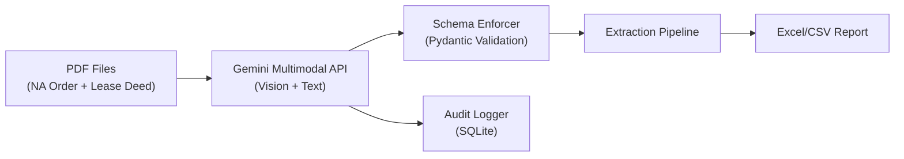

# The Compliance Clerk 🏛️

> LLM-powered document extraction pipeline for NA Permission Orders & Lease Deeds

## Overview

A Python pipeline that uses **Google Gemini's multimodal API** to extract structured data from government PDF documents — including scanned/image-based PDFs — and consolidates them into a standardized Excel report.

## Architecture



**Key Design Decision**: PDFs are sent directly to Gemini's vision API as base64 inline data, bypassing text extraction. This handles scanned documents and CID-encoded Gujarati fonts that traditional parsers (pdfplumber) cannot read.

## Features

- **Multimodal PDF Extraction** — Sends PDFs directly to Gemini's vision API (handles scanned & text-based PDFs)
- **Schema Enforcement** — Pydantic models validate every LLM response
- **Incremental Processing** — Only processes new PDFs, reuses cached results (`--incremental`)
- **Rate-Limit Resilient** — Smart retry logic with server-specified delays for free tier
- **Audit Trail** — All LLM interactions logged to SQLite
- **Demo Mode** — Offline testing with cached responses (`--demo`)
- **Styled Excel Reports** — Output matches expected assignment format

## Project Structure

```
navspark/
├── compliance_clerk/           # Core package
│   ├── parsers/                # PDF classification & document pairing
│   ├── models/                 # Pydantic schemas (NAOrder, LeaseDeed, Consolidated)
│   ├── llm/                    # LLM client, prompts, schema enforcement, demo mode
│   ├── audit/                  # SQLite audit logging
│   ├── pipeline/               # Extraction pipeline orchestration
│   └── output/                 # Excel/CSV report generation
├── data/
│   ├── input/                  # Place PDF files here
│   └── output/                 # Generated reports
├── tests/                      # 49 unit tests
├── main.py                     # CLI entry point
├── requirements.txt            # Dependencies
└── .env                        # API key (GEMINI_API_KEY)
```

## Quick Start

```bash
# 1. Install dependencies
pip install -r requirements.txt

# 2. Set up your Gemini API key
cp .env.example .env
# Edit .env → add your GEMINI_API_KEY from https://aistudio.google.com/apikey

# 3. Place NA Order and Lease Deed PDFs in data/input/

# 4. Run the extraction pipeline
python main.py --input-dir data/input/ --output-file data/output/output.xlsx
```

## 🌐 Web UI (Streamlit)

```bash
streamlit run app.py
```

Opens a browser with:
- 📤 Drag-and-drop PDF upload
- ⚙️ API/Demo mode toggle + incremental processing
- 📊 Live results table with area mismatch detection
- 📥 One-click Excel download

## Usage

```bash
# Full pipeline with Gemini API
python main.py --input-dir data/input/ --output-file data/output/output.xlsx

# Incremental mode (skip already-processed PDFs, only extract new ones)
python main.py --input-dir data/input/ --output-file data/output/output.xlsx --incremental

# Demo mode (no API key needed — uses cached responses)
python main.py --input-dir data/input/ --output-file data/output/output.xlsx --demo

# CSV output
python main.py --input-dir data/input/ --output-file data/output/output.csv --format csv

# Verbose logging
python main.py --input-dir data/input/ --output-file data/output/output.xlsx -v

# Export audit trail
python main.py --input-dir data/input/ --output-file data/output/output.xlsx --export-audit data/audit.jsonl
```

## Output Format

| Sr.no. | Village | Survey No. | Area in NA Order | Dated | NA Order No. | Lease Deed Doc. No. | Lease Area | Lease Start |
|--------|---------|------------|------------------|-------|--------------|---------------------|------------|-------------|
| 1 | Rampura Mota | 251/p2 | 4047 | 16/02/2026 | iORA/31/02/112/25/2026 | 141/2026 | 4047 | 21/01/2026 |
| 2 | Rampura Mota | 255 | 16491 | 08/01/2026 | iORA/31/02/112/9/2026 | 838/2025 | 16888 | 28/05/2025 |

## Document Types

| Document | Fields Extracted | PDF Type |
|----------|-----------------|----------|
| NA Order | Survey No., Village, Area, Date, Order No. | Text-based (CID-encoded Gujarati) |
| Lease Deed | Survey No., Doc No., Lease Area, Start Date | Scanned images |

## Testing

```bash
# Run all 49 tests
pytest tests/ -v

# Individual test suites
pytest tests/test_pdf_extractor.py -v     # PDF parsing & classification
pytest tests/test_schemas.py -v            # Pydantic model validation
pytest tests/test_schema_enforcer.py -v    # JSON extraction & enforcement
```

## Configuration

| Variable | Description | Default |
|----------|-------------|---------|
| `GEMINI_API_KEY` | Google Gemini API key (in `.env`) | Required |
| `LLM_MODEL_NAME` | Gemini model | `gemini-2.5-flash` |
| `LLM_TEMPERATURE` | LLM temperature | `0.1` |
| `LLM_MAX_RETRIES` | Max retry attempts | `3` |

## Tech Stack

- **Python 3.10+**
- **Google Gemini API** (multimodal — text + vision)
- **Pydantic** — schema validation
- **pdfplumber** — PDF classification
- **openpyxl** — Excel generation
- **SQLite** — audit logging

## License

MIT
